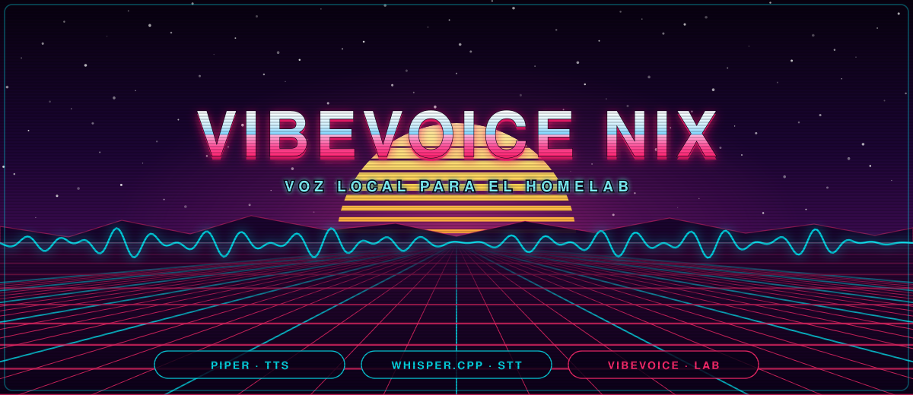

<p align="center">
  
</p>

# VibeVoiceNix

Stack de voz en español para un homelab, declarado por completo en NixOS y
desplegable sobre cualquier Proxmox con un comando.

Nace de montar el stack a mano en un contenedor Debian, medirlo, y pasarlo a
algo inmutable y replicable. **Todos los números de este README están medidos**
en un Intel i7-8700T (6 núcleos, AVX2, sin GPU).

## Qué hace

| Componente | Papel | RTF medido |
|---|---|---|
| **Piper** | TTS de producción | **0,042** (24× tiempo real) |
| **whisper.cpp** | STT | **0,671** con el modelo `small` |
| **VibeVoice-Realtime-0.5B** | TTS expresivo en streaming | **0,75** — primer sonido en **0,20 s** |

La API expone `/tts` y `/stt` por HTTP para que un agente —OpenClaw, por
ejemplo— pueda mandar y entender notas de voz. El TTS devuelve **ogg/opus** por
defecto, que es el formato que aceptan WhatsApp y Telegram como nota de voz.

```bash
# Generar una nota de voz
curl -X POST http://voz:8080/tts \
  -H "Authorization: Bearer $TOKEN" \
  -H 'Content-Type: application/json' \
  -d '{"texto":"El backup terminó sin errores."}' \
  -o nota.ogg

# Entender una nota de voz
curl -X POST http://voz:8080/stt \
  -H "Authorization: Bearer $TOKEN" \
  -F archivo=@nota.ogg
```

**VibeVoice empezó siendo un laboratorio y acabó siendo utilizable:** de **RTF
5,39 a 0,75** (7,2× más rápido) y del primer sonido en **23,21 s a 0,20 s**. El
viaje completo, con lo que funcionó y lo que no, está en
[docs/optimizacion.md](docs/optimizacion.md).

## Tres cosas que conviene saber antes de empezar

**VibeVoice apenas habla español.** El 1.5B y el Large-7B están entrenados solo
con inglés y chino. El único con voces en español es el Realtime-0.5B, y
Microsoft las añadió en diciembre de 2025 marcadas como experimentales. Para
notas de voz rápidas sigue estando Piper, que es ~18× más rápido y pesa 100 MB
en vez de 2,3 GB.

**Una GPU integrada no ayuda.** Se probó pasar una Intel UHD 630 al contenedor.
Funciona (OpenCL 3.0, Vulkan 1.3), pero medido con whisper.cpp resultó **2,5×
más lenta que la CPU**:

| | `base` | `small` |
|---|---|---|
| CPU, 6 hilos | 1,53 s | 5,18 s |
| iGPU Vulkan | 7,65 s | 12,88 s |

El propio informe de ggml lo explica: `matrix cores: none`, `bf16: 0`. Y PyTorch
nunca soportará esa generación — XPU e IPEX cubren Arc/Xe en adelante, y en la
máquina `torch.xpu.is_available()` devuelve `False`. Por eso el diseño es
CPU-only y no hay passthrough de GPU en el Terraform.

**El prompt de whisper es el ajuste que más se nota.** whisper.cpp acepta un
prompt inicial que sesga el vocabulario. Sin él:

> Soy tu **omelab**. El túnel de **We The War** se cayó...

Con una lista de la jerga propia en `services.voz-api.promptSTT`:

> Soy tu **homelab**. El túnel de **WireGuard** se cayó...

---

# El proyecto, por partes

<details>
<summary><h3>🏗️ &nbsp;Cómo se construye — del flake a la VM</h3></summary>

<br>

**La regla que lo organiza todo:** *si algo no está en el flake, no existe.* No hay pasos manuales después
de instalar, y el único estado que sobrevive a una reinstalación es el token, que se regenera solo.

### El mapa

```
flake.nix                    entradas y nixosConfigurations.voz
nix/
  options.nix                opciones propias (claves SSH, disco, túnel)
  host.nix                   ← lo único que tienes que editar
  configuration.nix          sistema base
  disko.nix                  particionado declarativo
  imagenes.nix               imágenes Docker construidas desde los mismos paquetes
  modules/
    voz-api.nix              Piper + fachada HTTP + consola          :8080
    whisper.nix              whisper.cpp residente en loopback       :8081
    voz-stream.nix           VibeVoice en streaming                  :8082
    vibevoice.nix            orden `vibevoice` (no es un servicio)
    vibevoice-ov.nix         genera los grafos OpenVINO en la VM
    tunel.nix                WireGuard hacia el edge (CGNAT)
  pkgs/
    piper-voices.nix         voces con hash fijo
    vibevoice-weights.nix    pesos y voces con hash fijo
  overlay.nix                uv2nix -> voz-api y vibevoice-env
pkgs/
  voz-api/                   FastAPI + Piper + caché + consola HTML
  vibevoice-cli/             CLI propia y servidor de streaming
  vibevoice-ov/              motor OpenVINO y conversores a IR
docker/                      Dockerfiles multiarquitectura, sin Nix
terraform/                   la VM en Proxmox
ansible/playbooks/           provision -> install -> update
bruno/                       colección de API para probar a mano
scripts/                     narrador, asistente y banco de fidelidad
docs/                        documentación extendida
```

### Las cuatro capas

```
1 · Entradas fijadas    flake.lock — nixpkgs, disko, nixos-anywhere, uv2nix
        ↓
2 · Paquetes            overlay.nix — voz-api, vibevoice-env, voces, pesos
        ↓
3 · Módulos             nix/modules/ — los servicios systemd
        ↓
4 · El sistema          nixosConfigurations.voz
        ↓
5 · Orquestación        terraform (la VM) + ansible (el ciclo)
```

### Por qué uv2nix

VibeVoice **no está en nixpkgs ni en PyPI**. `pkgs/vibevoice/uv.lock` clava el commit del repo
(`94da20d`) y la rueda `torch 2.13.0+cpu` desde el índice CPU de PyTorch — el lock no contiene **ningún**
paquete de NVIDIA, que en una máquina sin GPU serían 2,5 GB tirados. uv2nix traduce ese lock a derivaciones
Nix, así que el entorno se reconstruye idéntico.

Los pesos (1,9 GB) y las voces entran como descargas con hash fijo: si Hugging Face sirviera otra cosa, el
build falla en vez de instalar algo distinto en silencio.

### Por qué Ansible no configura nada

NixOS ya es configuración declarativa. Si Ansible tocara el sistema habría **dos fuentes de verdad** y se
perdería justo la propiedad que se busca. Aquí Ansible hace lo que Nix no hace: **encadenar el ciclo** y
verificar cada paso.

| Playbook | Qué hace |
|---|---|
| `provision.yml` | valida `terraform.tfvars`, `tofu apply`, genera el inventario |
| `install.yml` | **pide confirmación**, comprueba que el flake evalúa, `nixos-anywhere`, verifica la API |
| `update.yml` | comprueba que evalúa, aplica, confirma que la API sigue en pie |

Los tres validan **antes** de tocar nada y verifican **después**.

### Evaluar no es construir

El flake evaluaba limpio desde el principio y aun así tenía **tres fallos de construcción**:

| Fallo | Causa | Arreglo |
|---|---|---|
| `No module named 'setuptools'` | uv2nix compila sin aislamiento y VibeVoice usa `setuptools.build_meta` | `resolveBuildSystem { setuptools = []; }` |
| `libtbb.so.12` no satisfecha en `numba` | la rueda enlaza oneTBB sin declararlo | `pkgs.tbb` en `buildInputs` |
| `cannot load library 'libsndfile.so'` | `soundfile` hace `dlopen` **por nombre en ejecución** | sustituir por la ruta absoluta del store |

**El detalle completo:** [docs/arquitectura.md](docs/arquitectura.md)

</details>

<details>
<summary><h3>⚡ &nbsp;Decisiones de optimización — qué se probó y qué funcionó</h3></summary>

<br>

### El viaje: 7,2× más rápido

| Cambio | RTF | Ganancia |
|---|---|---|
| Punto de partida — fp32, 20 pasos | 5,39 | — |
| Cuantización int8 dinámica | 2,75 | 1,96× |
| 6 pasos de difusión en vez de 20 | 2,18 | 1,26× |
| Motor OpenVINO | 1,09 | 2,00× |
| **Reescribir las convoluciones depthwise** | **0,75** | 1,45× |

Y en paralelo, **sin coste en tiempo**:

| Cambio | Antes | Después |
|---|---|---|
| Streaming | primer sonido 23,21 s | **0,20 s** |
| Guía CFG de 1,5 → 3,0 | WER 13,6 %, peor 85,7 % | **3,6 %**, peor 14,3 % |
| Soltar pesos muertos | 3718 MB | **2832 MB** |

### El hallazgo que ordena todo

**El cuello es el ancho de banda de memoria, no el cómputo.** Medido: la CPU alcanza **17,2 GB/s de los
21,3 teóricos = 80,7 %**, el techo práctico de la DDR4.

**Corolario:** lo que paga es **reducir bytes de peso** (cuantización), no reducir operaciones. Por eso
int8 ganó un 96 % y `torch.compile` dio exactamente 1,00×.

### La optimización más rentable salió del perfilador

`aten::_slow_conv2d_forward` se llevaba el **75 % del tiempo** con **22.434 llamadas por `decode`**. El
decodificador tiene 26 convoluciones *depthwise* de `groups=2048`, y **torch no trae kernel optimizado para
depthwise sin oneDNN**: cae a la implementación de referencia y las procesa grupo por grupo.

Una depthwise es solo multiplicar por un escalar por canal y sumar. Vectorizado:

| | Tiempo |
|---|---|
| `Conv1d` depthwise (torch) | 36,85 ms |
| suma de 7 desplazamientos | **0,35 ms** → **106× por capa** |

Audio verificado idéntico: correlación **0,99998152**.

### Lo que NO funcionó (no lo repitas)

| Idea | Qué pasó |
|---|---|
| La iGPU Intel | 2,5× más lenta, y comparte el mismo bus: ni suma ancho de banda |
| Más hilos | **empeora** — 12 hilos: 24 % peor. Óptimo: 6 anclados |
| Bajar `cfg_scale` para acelerar | **no afecta** al tiempo (1.5/1.3/1.0 → 3,92/4,02/4,20) |
| `torch.compile` | 1,00×. Nada |
| bf16 | Coffee Lake no tiene AVX512-BF16: sería emulado |
| int4 en la cabeza de difusión | **sesga el fin de frase** (95 tokens vs 84) y empata en RTF |
| Decoder de OpenVINO en híbrido | rápido pero **ininteligible** |

> ⚠️ **Una trampa que se invierte según el motor:** `OMP_PLACES=cores` acelera PyTorch un 3 % pero
> **ralentiza OpenVINO un 118 %** (89 → 195 ms/llamada). Si cambia el motor, hay que invertir el ajuste.

**El documento completo, con las reglas para medir sin engañarse:**
[docs/optimizacion.md](docs/optimizacion.md)

</details>

<details>
<summary><h3>🚀 &nbsp;Desplegar y operar</h3></summary>

<br>

Requisitos: **Nix con flakes**. Todo lo demás lo trae el `devShell`.

```bash
nix develop            # trae tofu, ansible, uv y nixos-anywhere
```

### El ciclo completo

**1 · Configura tu entorno** — dos ficheros, y las claves SSH deben coincidir:

```bash
cp terraform/terraform.tfvars.example terraform/terraform.tfvars
$EDITOR terraform/terraform.tfvars   # token de Proxmox, IP, recursos
$EDITOR nix/host.nix                 # tu clave pública y el disco
```

El token de Proxmox se crea en el host con:

```bash
pveum user token add root@pam terraform --privsep 0
```

**2 · Crea la VM:**

```bash
ansible-playbook ansible/playbooks/provision.yml
```

**3 · Instala NixOS** (formatea el disco, pide confirmación antes):

```bash
ansible-playbook ansible/playbooks/install.yml
```

**4 · El día a día**, tras cambiar cualquier cosa en `nix/`:

```bash
ansible-playbook ansible/playbooks/update.yml
```

### Comprobar que funciona

```bash
curl -s http://voz:8080/health | jq
ssh juan@voz sudo cat /var/lib/voz/token.env    # el token, generado solo
```

Dos campos que mirar: `stt.disponible` tiene que ser `true`, y `auth` tiene que decir `bearer` — si dice
`abierta`, el token no llegó al servicio.

### Volver atrás

Cada reconstrucción crea una generación y **ninguna borra la anterior**:

```bash
sudo nixos-rebuild switch --rollback
```

Si la máquina no arranca, el menú de `systemd-boot` lista todas las generaciones.

### Sin Nix: Docker

```bash
cd docker && docker compose up -d                        # Piper + whisper
docker compose --profile pesado up -d                    # + VibeVoice (7 GB)
docker compose --profile gpu up -d --build               # + VibeVoice con CUDA
```

Los Dockerfiles son normales y **multiarquitectura**: `docker build` compila para la máquina donde se
lanza, así que en un Mac ARM salen imágenes ARM. Comparten el `uv.lock` con la VM, así que las versiones no
pueden divergir.

**El detalle completo:** [docs/despliegue.md](docs/despliegue.md)

</details>

<details>
<summary><h3>🔌 &nbsp;Usar la API</h3></summary>

<br>

Tres servicios, tres puertos:

| Servicio | Puerto | Qué expone |
|---|---|---|
| `voz-api` | **8080** | `/tts`, `/stt`, `/voces`, `/health` y la consola en `/` |
| `homelab-whisper` | 8081 | solo loopback — no se abre nunca |
| `voz-stream` | **8082** | TTS expresivo en streaming |

Todas piden `Authorization: Bearer $TOKEN`, salvo `/health` y `/voces`.

### TTS — texto a voz

```bash
curl -X POST http://voz:8080/tts -H "Authorization: Bearer $TOKEN" -H 'Content-Type: application/json' -d '{"texto":"El backup terminó sin errores.","voz":"es_MX-claude-high","formato":"ogg"}' -o nota.ogg
```

| Formato | Para qué |
|---|---|
| `ogg` | **nota de voz de WhatsApp y Telegram** — Opus 32 kbps, perfil `voip`. El defecto |
| `mp3` | compatibilidad universal |
| `wav` | sin recodificar, para encadenar procesado |

La respuesta trae la medición en cabeceras: `X-Duracion-S`, `X-Proceso-S`, `X-RTF`, `X-Voz`.

### STT — voz a texto

```bash
curl -X POST http://voz:8080/stt -H "Authorization: Bearer $TOKEN" -F "archivo=@nota-de-voz.ogg" -F "idioma=es" | jq
```

Acepta **cualquier formato que entienda ffmpeg**: la API normaliza a WAV 16 kHz mono por su cuenta.

Puedes pasar un `prompt` propio para sesgar el vocabulario en esa llamada:

```bash
-F "prompt=Nombres propios: Beatriz, Kubernetes, Grafana, Tailscale."
```

### Streaming — se oye según se genera

```bash
curl -sN -X POST http://voz:8082/tts -H "Authorization: Bearer $TOKEN" -H 'Content-Type: application/json' -d '{"texto":"Se oye según se genera."}' | ffplay -autoexit -nodisp -
```

Llega como WAV por trozos de 133 ms, mono 24 kHz PCM de 16 bits. El audio es **bit a bit idéntico** al de
la generación normal: no es una versión degradada.

> Bruno **no** es buen cliente para esto: espera a tener la respuesta completa. Usa `curl -sN`, la consola
> del navegador, o la colección de [`bruno/`](bruno/) para el resto de rutas.

### Desde Python

```python
import httpx

CAB = {"Authorization": f"Bearer {TOKEN}"}

r = httpx.post("http://voz:8080/tts", headers=CAB,
               json={"texto": "El despliegue terminó sin errores."}, timeout=60)
open("nota.ogg", "wb").write(r.content)
print("RTF:", r.headers["X-RTF"])

with open("entrante.ogg", "rb") as f:
    r = httpx.post("http://voz:8080/stt", headers=CAB,
                   files={"archivo": f}, data={"idioma": "es"}, timeout=300)
print(r.json()["texto"])
```

**La referencia completa:** [docs/api.md](docs/api.md)

</details>

<details>
<summary><h3>🖥️ &nbsp;Dónde puede correr</h3></summary>

<br>

El mismo código va en tres sitios, pero **no por el mismo camino**. El dispositivo se elige solo
(`cuda` → `mps` → `cpu`) y se puede forzar con `VIBEVOICE_DISPOSITIVO`.

| Dónde | Cómo | Dispositivo |
|---|---|---|
| VM Linux / servidor | NixOS, o `docker compose --profile pesado up -d` | `cpu` |
| Mac con Apple Silicon | `./scripts/voz-stream-mac.sh` (**nativo**) | `mps` |
| PC con NVIDIA | `docker compose --profile gpu up -d --build` | `cuda` |

En CPU el modelo se cuantiza a int8; en GPU va en fp16 sin cuantizar, porque el int8 dinámico de PyTorch
**solo está implementado para CPU**. Son dos caminos distintos, no un parámetro.

### En el Mac tiene que ser nativo

Los contenedores en macOS corren dentro de una VM Linux que **no tiene acceso a Metal**. Desde un
contenedor, `torch.backends.mps.is_available()` siempre da `False`, se configure lo que se configure.

```bash
cd docker && docker compose up -d   # Piper + whisper en el 8080
./scripts/voz-stream-mac.sh         # VibeVoice en el 8082
```

La consola del 8080 encuentra el 8082 sola. Medido en el mismo Mac: **MPS RTF 1,39 contra 2,96 en CPU**.

### Con una NVIDIA no basta con tener la tarjeta

El lock fija la rueda de torch **sin CUDA compilado**, así que `torch.cuda.is_available()` daría `False`
por buena que fuera la GPU. El perfil `gpu` usa el mismo Dockerfile pero sustituye torch por la rueda de
`cu130` — misma versión 2.13.0, así que cambia el backend y no la versión.

```bash
docker run --rm --gpus all nvidia/cuda:12.6.0-base-ubuntu24.04 nvidia-smi   # compruébalo antes
```

### Llegar desde fuera de casa

La casa está tras **CGNAT**, así que la VM abre un túnel WireGuard hacia un edge en Oracle, que hace de
punto de encuentro. Un móvil conectado al edge alcanza la VM por `10.10.10.5`. **No expone nada a
internet**: la API sigue escuchando solo en la LAN y en la red del túnel.

**El análisis completo de hardware:** [docs/hardware-y-portabilidad.md](docs/hardware-y-portabilidad.md)

</details>

<details>
<summary><h3>🎛️ &nbsp;Ajustes que importan</h3></summary>

<br>

```nix
services.voz-api = {
  voces = [ "es_MX-claude-high" "es_MX-ald-medium" "es_ES-davefx-medium" ];
  vozDefecto = "es_MX-claude-high";
  promptSTT = "Vocabulario tecnico: ... tu jerga aqui ...";
};

services.homelab-whisper.modelo = "small";   # o "base", 3x más rápido y peor

services.vibevoice = {
  pasosDifusion = 6;        # 4 solo mejora un 3 %: no compensa
  hilos = 6;                # más hilos EMPEORA — ver optimización
  anclarNucleos = true;     # ojo: invertir esto si el motor pasa a OpenVINO
};
```

### Las voces de Piper

Las cinco están medidas con el mismo texto. `es_MX-claude-high` es la de por defecto por ser
latinoamericana y la más rápida de las de calidad `high`.

| Voz | Origen | RTF | Tamaño |
|---|---|---|---|
| `es_MX-claude-high` | México | 0,152 | 61 MB |
| `es_MX-ald-medium` | México | 0,151 | 61 MB |
| `es_ES-sharvard-medium` | España | 0,177 | 74 MB |
| `es_ES-davefx-medium` | España | 0,191 | 61 MB |
| `es_AR-daniela-high` | Argentina | 0,408 | 109 MB |

### La guía CFG: calidad, no velocidad

Medido con el banco de fidelidad (circuito texto → voz → whisper → texto):

| `cfg_scale` | WER medio | Peor caso |
|---|---|---|
| 1,5 | 13,6 % | 85,7 % |
| **3,0** | **3,6 %** | **14,3 %** |

Y **no cuesta tiempo**: la difusión evalúa la rama positiva y la negativa en un lote de 2 pase lo que pase.
El servicio de streaming ya usa **3.0** por defecto.

> ⚠️ **Inconsistencia conocida:** `services.vibevoice.cfgScale` (el camino de la CLI) sigue en `1.5` y su
> descripción dice «déjalo en 1.5», escrita antes de que existiera el banco de fidelidad. El servicio de
> streaming usa 3.0. Conviene alinearlos.

### Las aserciones que impiden construir

| Condición | Por qué |
|---|---|
| `homelab.clavesSSH != [ ]` | la VM se instalaría sin ninguna forma de entrar |
| `vozDefecto ∈ voces` | fallaría en la primera petición |
| `abrirCortafuegos → ficheroToken != null` | expondría el TTS y el STT a toda la LAN |
| `swapDevices != [ ]` con vibevoice activo | una generación se llevaría por delante al que pida memoria |

**La referencia completa:** [docs/opciones.md](docs/opciones.md)

</details>

<details>
<summary><h3>🧪 &nbsp;Probar y medir</h3></summary>

<br>

### La consola en el navegador

`http://voz:8080/` — la sirve `voz-api`. Cubre TTS, STT por micrófono o fichero, y el circuito completo
generando audio y transcribiéndolo de vuelta.

Para el streaming muestra **el pipeline por estados y colores**, así que se ve dónde está el tiempo sin
leer un log:

| Color | Estado |
|---|---|
| gris | el LLM aún escribe (pendiente) |
| azul | segmentado: el trozo se cerró y espera turno |
| ámbar | sintetizando (parpadea) |
| verde | sonando |

### Medir sin instrumentar nada

```bash
# TTS: las cabeceras X-* traen la medición de esa síntesis
curl -s -X POST http://voz:8080/tts -H "Authorization: Bearer $TOKEN" -H 'Content-Type: application/json' -d '{"texto":"Prueba de rendimiento."}' -o /dev/null -D- | grep '^X-'
```

**Lánzala dos veces:** la primera incluye la carga del `.onnx`; la segunda es el coste real.

### Los scripts

```bash
python scripts/fidelidad.py      # banco: texto -> voz -> whisper -> texto, mide WER
python scripts/narrador.py       # pone voz a un LLM según escribe
python scripts/asistente.py      # Ollama -> voz, en la terminal
python scripts/asistente_web.py  # lo mismo, con página en el navegador
```

**Medido con el asistente** (qwen3:1.7b contra la VM):

```
1er token del LLM   1,68 s
1a frase lista      1,76 s
PRIMER SONIDO       2,22 s
  de los cuales voz   0,46 s
```

De 6,99 s con qwen3:4b a 2,22 s con el 1.7b: **el modelo de lenguaje era el cuello, no la voz**. Y con
qwen3 razonando sube a 24 s, porque el bloque `<think>` se genera entero antes de responder — para voz
conviene desactivarlo.

### Bruno

La colección en [`bruno/`](bruno/) cubre estado, TTS, STT y streaming, con entornos para LAN, túnel y
local. El token va como variable secreta, fuera del repo.

</details>

<details>
<summary><h3>🩺 &nbsp;Cuando algo falla</h3></summary>

<br>

| Síntoma | Causa y solución |
|---|---|
| *«Falta terraform/terraform.tfvars»* | Copia el `.example` y rellénalo. `provision.yml` para antes de tocar nada |
| *«homelab.clavesSSH está vacío»* | Pon tu clave pública en `nix/host.nix`. Es una aserción a propósito |
| *«necesita ~4 GB… no define swap»* | Añade `swapDevices` o desactiva `services.vibevoice` |
| `disko` formatea el disco que no era | `homelab.disco` no coincide. Terraform usa `scsi0` → `/dev/sda`. Compruébalo con `lsblk` |
| Instala pero no arranca | La VM no está en modo UEFI. `systemd-boot` necesita una ESP |
| `401 token invalido o ausente` | Falta la cabecera, o no es el token de `/var/lib/voz/token.env` |
| `/health` dice `"disponible": false` | whisper no está levantado: `journalctl -u homelab-whisper -e` |
| `400 no pude decodificar el audio` | ffmpeg no reconoce el fichero; el mensaje trae su salida de error |
| El STT transcribe mal la jerga | Ajusta `promptSTT`. Es el parámetro que más cambia el resultado |
| El contenedor pesado reinicia sin fin | Necesita **7 GB**, no 6. Muere con código 0 y `OOMKilled: false`, así que **parece un cierre limpio** |
| La consola dice «no responde en el 8082» | `voz-stream` es opcional y tarda ~2 min en cargar. Reintenta sola cada 10 s |
| El streaming se corta a trozos | Los IR de OpenVINO no se generaron y cayó a torch (RTF 2,2 en vez de 1,09) |

```bash
journalctl -u voz-api -u homelab-whisper -u voz-stream -u voz-token -e
```

### Dos trampas de diagnóstico que costaron caro

**El contenedor que «se cierra limpiamente».** Cuando el sistema mata el proceso por memoria, sale con
**código 0 y `OOMKilled: false`**. Parece un cierre correcto y es el kernel matándolo. Se ve midiendo el
pico paso a paso, no leyendo el estado de salida.

**`docker stats` engaña.** Incluye la caché de disco: reportaba 4,8 GB donde había 3,8 reales.

</details>

---

## Estado

- [x] El flake evalúa y produce el sistema completo
- [x] Voces y pesos con hash verificado contra los ficheros reales
- [x] `voz-api` construye y sirve `/tts`, `/stt`, `/health`, `/voces` y la consola
- [x] `vibevoice-env` construye y genera audio en español desde el store
- [x] **VibeVoice en tiempo real**: RTF 0,75, primer sonido 0,20 s
- [x] Streaming, túnel WireGuard, imágenes Docker y colección Bruno
- [ ] Despliegue de punta a punta contra Proxmox

**Pendiente con mejor retorno:** 20 € de RAM. La máquina está en *single channel* y el ancho de banda es el
cuello medido; un segundo módulo lo duplica. Ver [docs/optimizacion.md](docs/optimizacion.md).

## Documentación

Este README es el resumen. El detalle está en [`docs/`](docs/):

| Documento | Qué contiene |
|---|---|
| [optimizacion.md](docs/optimizacion.md) | **el viaje de RTF 5,39 a 0,75**, lo que no funcionó, y cómo medir sin engañarse |
| [arquitectura.md](docs/arquitectura.md) | las capas del flake, el overlay `uv2nix`, los modelos como paquetes y el endurecimiento de los servicios |
| [despliegue.md](docs/despliegue.md) | el ciclo `provision → install → update`, cómo actualizar y cómo volver atrás |
| [api.md](docs/api.md) | referencia HTTP completa, con ejemplos, cabeceras de métricas y tabla de errores |
| [opciones.md](docs/opciones.md) | todas las opciones NixOS, sus aserciones y configuraciones de ejemplo |
| [rendimiento.md](docs/rendimiento.md) | las mediciones de Piper, whisper y la iGPU contra la CPU |
| [hardware-y-portabilidad.md](docs/hardware-y-portabilidad.md) | GPU por passthrough, RAM y llevar el stack al Mac |

## Licencias

VibeVoice es MIT (Microsoft). Las voces de Piper tienen cada una la suya, en su
`.onnx.json`. Los modelos de whisper.cpp son MIT.
