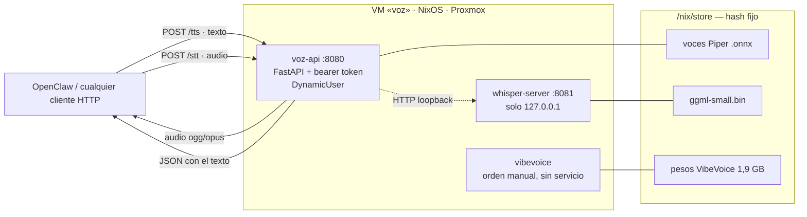

<p align="center">
  
</p>

<h1 align="center">VibeVoiceNix</h1>

<p align="center">
  <b>Una VM de Proxmox que habla y escucha, definida entera en Nix.</b><br>
  Síntesis de voz (TTS) y reconocimiento de voz (STT) en local, sin nube, sin API de pago y sin pasos manuales.
</p>

---

## La idea

Un agente doméstico —en este caso OpenClaw— necesita **mandar y entender notas de voz**. Las opciones de
siempre son mandar el audio a la nube (Whisper de OpenAI, ElevenLabs, Google) y pagar por token, o montar
los motores a mano en un contenedor y rezar para poder reconstruirlo dentro de seis meses.

Este repositorio hace lo tercero: **describe la máquina entera como código**. Un `flake.nix` declara el
sistema operativo, los tres motores de voz, los modelos con su hash, los servicios `systemd`, el
particionado del disco y el endurecimiento de seguridad. Con una orden se instala sobre una VM vacía de
Proxmox; con la misma orden se reconstruye idéntica en otra máquina.

```
                 ┌──────────────────────────────────────────┐
   texto  ─────► │                                          │ ─────►  audio (ogg/mp3/wav)
                 │   VM «voz» en Proxmox · NixOS            │
   audio  ─────► │   Piper · whisper.cpp · VibeVoice        │ ─────►  texto transcrito
                 └──────────────────────────────────────────┘
                        una sola orden la reconstruye
```

El principio de diseño es uno solo y está escrito en [`nix/configuration.nix`](nix/configuration.nix):

> Todo lo que define la máquina está aquí o en los módulos: no hay pasos manuales después de instalar.
> **Si algo no está en el flake, no existe.**

### Por qué no la nube

| | Nube (OpenAI / ElevenLabs) | Este stack |
|---|---|---|
| **Privacidad** | cada nota de voz sale de casa | el audio nunca abandona la LAN |
| **Coste** | por minuto / por carácter | 0 € una vez montado |
| **Latencia** | ida y vuelta a internet | red local, ~0,4 s para 10 s de audio |
| **Disponibilidad** | depende del proveedor | funciona con el router caído |
| **Reproducibilidad** | ninguna | hash fijo de cada modelo y cada dependencia |

---

## Los tres motores

Son tres porque hacen tres cosas distintas, y uno de ellos está a propósito **fuera** del camino de
producción.

| Motor | Papel | Cómo se expone | RTF medido |
|---|---|---|---|
| **[Piper](https://github.com/OHF-Voice/piper1-gpl)** | TTS — texto a voz | servicio `voz-api`, puerto 8080 | **0,042** con la voz ya en memoria |
| **[whisper.cpp](https://github.com/ggerganov/whisper.cpp)** | STT — voz a texto | servicio en loopback, puerto 8081 | **0,671** con el modelo `small` |
| **[VibeVoice-Realtime-0.5B](https://github.com/microsoft/VibeVoice)** | laboratorio de TTS neuronal | orden `vibevoice`, **sin servicio** | **4,80** — 44 s de cómputo por 9 s de audio |

> **RTF** (*real-time factor*) = tiempo de cómputo ÷ duración del audio. Por debajo de 1 es más rápido que
> el tiempo real. Todas las cifras están medidas en el host del proyecto, un **Intel i7-8700T sin GPU**.

**Por qué VibeVoice no sirve peticiones.** Da el nombre al repositorio y fue el punto de partida, pero es
~100× más lento que Piper y pide ~4 GB de RAM en el pico. Se quedó como banco de pruebas: se instala una
orden que se lanza a mano, no un servicio que escucha. La decisión, con sus números, está en
[docs/rendimiento.md](docs/rendimiento.md).

---

## Arquitectura



Lo que importa de este dibujo:

- **Una sola puerta.** Solo `voz-api` está en el cortafuegos. `whisper-server` escucha en `127.0.0.1` y no
  tiene autenticación propia: quien llega desde la red pasa por la API, que es quien exige el token.
- **Los modelos son parte del sistema.** No se descargan en el primer arranque: están en el store con su
  `sha256` fijado. Si Hugging Face sirviera otro fichero, la compilación falla en vez de instalar algo
  distinto en silencio.
- **El token no está en el store.** El store es legible por cualquier usuario del sistema, así que el
  secreto se genera en el primer arranque en `/var/lib/voz/token.env` y entra por `EnvironmentFile`.

El detalle de cada capa —flake, overlay `uv2nix`, módulos, empaquetado de los modelos— está en
[docs/arquitectura.md](docs/arquitectura.md).

---

## Tecnologías

| Capa | Herramienta | Papel en el proyecto |
|---|---|---|
| Sistema | **NixOS** — canal `nixos-unstable`, `stateVersion = 25.05` | el sistema entero es una función pura del flake |
| Empaquetado | **Nix flakes** | fija nixpkgs y todas las entradas en `flake.lock` |
| Virtualización | **Proxmox VE** | el hipervisor donde vive la VM |
| Instalación | **[nixos-anywhere](https://github.com/nix-community/nixos-anywhere)** | instala NixOS por SSH sobre una máquina vacía |
| Particionado | **[disko](https://github.com/nix-community/disko)** | GPT + ESP + ext4 declarativos; el instalador no pregunta nada |
| Python → Nix | **[uv2nix](https://github.com/pyproject-nix/uv2nix)** + `pyproject.nix` | traduce `uv.lock` a derivaciones; es lo que hace reproducible a VibeVoice |
| API | **FastAPI + Uvicorn** (Python 3.12) | fachada HTTP de TTS y STT |
| TTS | **Piper** (ONNX Runtime) | voces neuronales rápidas en CPU |
| STT | **whisper.cpp** | modelos `ggml`, servidor residente |
| TTS experimental | **VibeVoice-Realtime-0.5B** + **PyTorch 2.13 CPU** | laboratorio de voz por difusión |
| Audio | **ffmpeg**, **sox** | normaliza a 16 kHz mono y convierte a ogg/opus |
| Servicios | **systemd** | `DynamicUser`, `ProtectSystem=strict` y compañía |
| Provisión *(pendiente)* | **OpenTofu**, **Ansible** | crear la VM en Proxmox y orquestar el despliegue |

---

## Recursos necesarios

### En el hipervisor

Un Proxmox VE con espacio para una VM x86-64. No hace falta GPU: se midió que la iGPU Intel UHD 630 con
el backend Vulkan resulta **2,5× más lenta que la CPU**, así que todo el stack corre en CPU a propósito.

### La VM

| Perfil | vCPU | RAM | Disco | Qué entra |
|---|---|---|---|---|
| **Mínimo** | 2 | 2 GB | 20 GB | Piper + whisper `base`. Responde, pero el STT falla en vocabulario técnico. |
| **Recomendado** | 4–6 | 4 GB | 30 GB | Piper + whisper `small`. Es el camino de producción. |
| **Completo** *(el del repo)* | 6–8 | 8 GB + 4 GB de swap | 40 GB | Añade el laboratorio de VibeVoice. |

Los tamaños de disco son estimaciones: cuentan el sistema base de NixOS, los modelos y varias generaciones
antes de que pase el recolector de basura (semanal, `--delete-older-than 30d`).

**Ajustes de la VM en Proxmox**

- Tipo de máquina **UEFI (OVMF)** — el sistema arranca con `systemd-boot`.
- Controladora de disco **VirtIO SCSI** → el disco aparece como `/dev/sda`. Si usas VirtIO Block será
  `/dev/vda`; hay que ajustar `homelab.disco` en [`nix/host.nix`](nix/host.nix).
  **Compruébalo con `lsblk` antes del primer despliegue: disko formatea lo que le digas, sin preguntar.**
- Red en puente con la LAN, DHCP.
- Agente QEMU activado (el perfil `qemu-guest` ya está importado).

### Lo que se descarga la primera vez

| Artefacto | Tamaño |
|---|---|
| Modelo whisper `ggml-small.bin` | 466 MB |
| Voces de Piper (`medium` ≈ 60 MB · `high` hasta 109 MB) | ~250 MB las tres por defecto |
| Pesos de VibeVoice (`model.safetensors`, fp32) | 1,9 GB |
| PyTorch CPU + resto del entorno de VibeVoice | ~2 GB |

### En tu máquina

Solo **Nix con flakes**. El `devShell` trae OpenTofu, Ansible, `uv`, `jq`, `curl` y `nixos-anywhere`, así
que no hay que instalar nada más:

```bash
nix develop
```

---

## Arranque rápido

```bash
git clone https://github.com/juan52878911/VibeVoiceNix && cd VibeVoiceNix
```

**1. Pon tu clave pública y tu disco** en [`nix/host.nix`](nix/host.nix). Es el único fichero que hay que
tocar; sin una clave SSH la VM queda inaccesible tras instalar y una aserción del flake lo impide.

**2. Crea la VM en Proxmox** con los ajustes de arriba y arráncala con el ISO de NixOS (o cualquier sistema
con SSH y acceso root).

**3. Instálalo todo:**

```bash
nix run github:nix-community/nixos-anywhere -- --flake .#voz root@IP-DE-LA-VM
```

**4. Comprueba que responde:**

```bash
curl -s http://IP-DE-LA-VM:8080/health | jq
```

**5. Coge el token** que se generó solo en el primer arranque:

```bash
ssh juan@IP-DE-LA-VM sudo cat /var/lib/voz/token.env
```

Y ya se puede hablar con ella:

```bash
curl -X POST http://IP-DE-LA-VM:8080/tts \
  -H "Authorization: Bearer TU_TOKEN" \
  -H "Content-Type: application/json" \
  -d '{"texto":"El homelab ya tiene voz."}' \
  --output saludo.ogg
```

El procedimiento completo, con actualizaciones y vuelta atrás, está en [docs/despliegue.md](docs/despliegue.md).

---

## Mapa del repositorio

```
flake.nix                     entradas fijadas y salidas: nixosConfigurations.voz, packages, devShell
flake.lock                    la versión exacta de todo
nix/
  host.nix                    ← LO ÚNICO ESPECÍFICO DE TU MÁQUINA (clave SSH, disco)
  options.nix                 opciones propias: homelab.clavesSSH, homelab.disco
  configuration.nix           sistema base: arranque, red, SSH, los tres motores, token
  disko.nix                   particionado declarativo (GPT + ESP + ext4 + swapfile)
  overlay.nix                 convierte los uv.lock en entornos Python vía uv2nix
  modules/
    voz-api.nix               servicio de la API (TTS + fachada de STT)
    whisper.nix               servicio de whisper.cpp en loopback
    vibevoice.nix             la orden `vibevoice`; no levanta servicio
  pkgs/
    piper-voices.nix          catálogo de voces en español con hash fijo
    vibevoice-weights.nix     pesos, voces y script de inferencia parcheado
pkgs/
  voz-api/                    el código Python de la API (FastAPI)
  vibevoice/                  workspace de uv que fija VibeVoice y torch+cpu
docs/                         esta documentación
  banner.py                   genera banner.svg; el SVG es su salida, no se edita a mano
```

---

## Estado del proyecto

**Funciona hoy:** el sistema completo se instala con `nixos-anywhere` y los tres motores quedan operativos.

**Todavía no está en el repositorio:** la provisión automática de la VM. El `devShell` ya trae OpenTofu y
Ansible y el `shellHook` anuncia `ansible/playbooks/provision.yml`, pero esos directorios aún no existen —
por ahora la VM se crea a mano en la interfaz de Proxmox. Es el siguiente paso natural del proyecto.

**Otras cosas conocidas:**

- `packages.default` solo existe para `x86_64-linux`; en macOS hay que pedir `nix build .#voz-api` por su
  nombre. El entorno de VibeVoice tampoco se construye fuera del destino, porque el `uv.lock` fija ruedas
  de `torch+cpu` para Linux x86-64.
- El soporte de español en VibeVoice es **experimental**: sus voces `sp-Spk0_woman` y `sp-Spk1_man` las
  añadió Microsoft en diciembre de 2025 y están marcadas como tales. Los modelos 1.5B y Large-7B solo
  hablan inglés y chino.

---

## Documentación

| Documento | Qué contiene |
|---|---|
| [docs/arquitectura.md](docs/arquitectura.md) | cómo encaja todo y **por qué** cada decisión es la que es |
| [docs/despliegue.md](docs/despliegue.md) | de una VM vacía a un sistema funcionando; actualizar y volver atrás |
| [docs/api.md](docs/api.md) | referencia HTTP de `/tts`, `/stt`, `/voces` y `/health` con ejemplos |
| [docs/opciones.md](docs/opciones.md) | todas las opciones NixOS y variables de entorno |
| [docs/rendimiento.md](docs/rendimiento.md) | las mediciones que justifican Piper, whisper `small` y CPU sin GPU |
