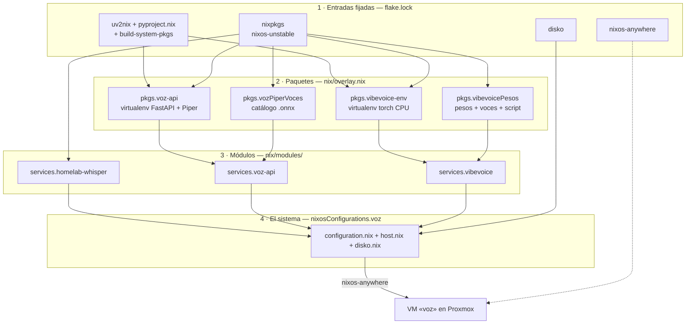
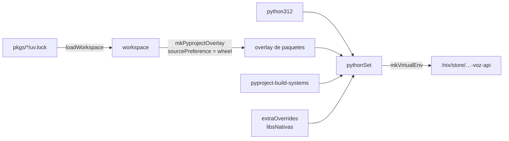
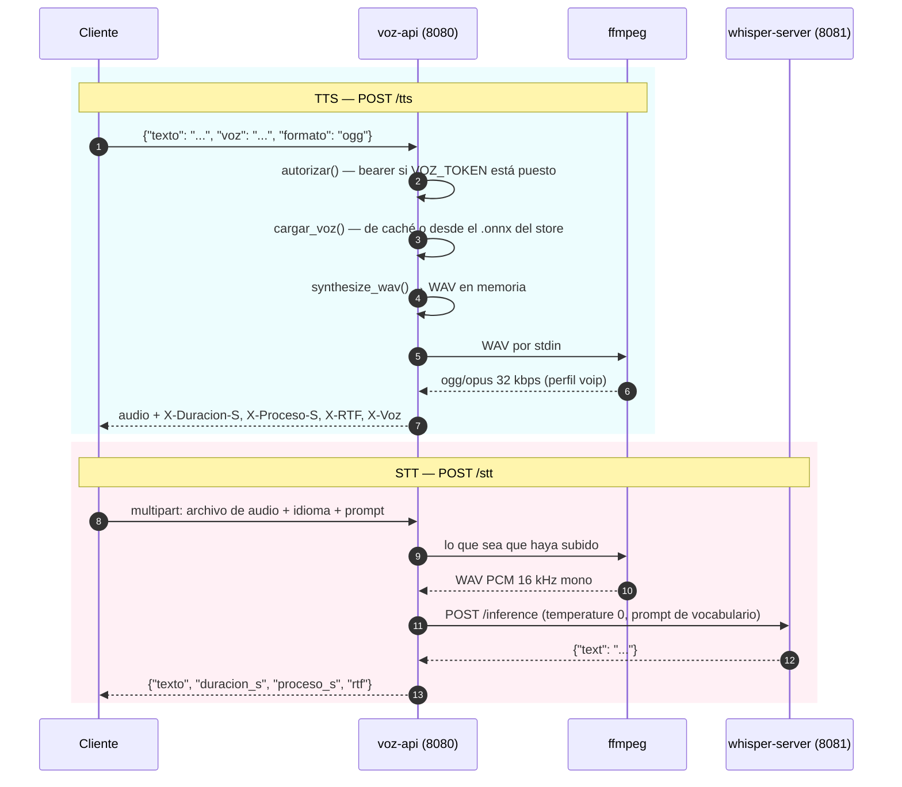
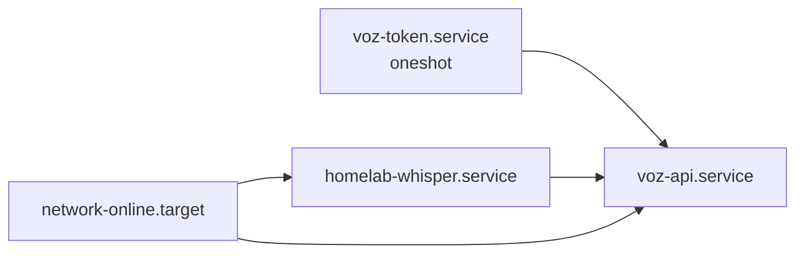

# Arquitectura

Cómo encaja el proyecto y, sobre todo, **por qué** cada pieza es la que es. Casi todas las decisiones que
aparecen aquí están justificadas por una medición o por una restricción concreta; cuando es así, se dice
cuál.

- [Las cuatro capas](#las-cuatro-capas)
- [El flake](#el-flake)
- [El overlay: de `uv.lock` a derivación](#el-overlay-de-uvlock-a-derivación)
- [Los modelos como paquetes](#los-modelos-como-paquetes)
- [Los módulos NixOS](#los-módulos-nixos)
- [La API](#la-api)
- [Ciclo de vida de una petición](#ciclo-de-vida-de-una-petición)
- [Arranque y orden de servicios](#arranque-y-orden-de-servicios)
- [Seguridad](#seguridad)
- [Decisiones de diseño](#decisiones-de-diseño)

---

## Las cuatro capas



La regla que organiza todo esto está escrita en la cabecera de
[`nix/configuration.nix`](../nix/configuration.nix): *si algo no está en el flake, no existe*. No hay un
`README` con «y ahora ejecuta esto a mano»; no hay estado que sobreviva a una reinstalación salvo el token,
y ese se regenera solo.

---

## El flake

[`flake.nix`](../flake.nix) declara seis entradas y cinco salidas.

**Entradas.** `nixpkgs` apunta a `nixos-unstable`. `disko` y `nixos-anywhere` traen el instalador. Las tres
restantes —`pyproject-nix`, `uv2nix` y `pyproject-build-systems`— son el puente entre el ecosistema de
Python y Nix. Todas siguen a `nixpkgs` con `inputs.nixpkgs.follows`, así que hay **una sola** versión de
nixpkgs en todo el árbol y no se duplican dependencias.

**Salidas.**

| Salida | Qué es |
|---|---|
| `nixosConfigurations.voz` | el sistema completo; es lo que instala `nixos-anywhere --flake .#voz` |
| `overlays.default` | los paquetes propios, reutilizables desde otro flake |
| `packages.<sistema>` | `voz-api` en todas partes; `vibevoice-env` y `default` solo en `x86_64-linux` |
| `devShells.default` | OpenTofu, Ansible, `uv`, `jq`, `curl` y `nixos-anywhere` |
| `formatter` | `nixpkgs-fmt`, para `nix fmt` |

**Dos conjuntos de sistemas, y no es casualidad.** `sistemaDestino` es siempre `x86_64-linux`: la VM.
`sistemasDev` incluye además las dos variantes de macOS porque el repositorio se maneja desde un Mac ARM.
Por eso `vibevoice-env` está envuelto en un `optionalAttrs (system == sistemaDestino)`: el `uv.lock` fija
ruedas de `torch+cpu` para Linux x86-64 y pedirlo desde macOS solo daría un error confuso.

Lo mismo pasa con `nixos-anywhere` en el `devShell`, que se añade con `lib.optional` solo donde existe
paquete para ese sistema. La alternativa —listarlo a secas— rompería `nix develop` en cualquier plataforma
donde no compile.

---

## El overlay: de `uv.lock` a derivación

[`nix/overlay.nix`](../nix/overlay.nix) es la pieza menos obvia del repositorio y la que resuelve el
problema original: **VibeVoice no está en nixpkgs ni en PyPI**.

La función `mkEntorno` toma un directorio con `pyproject.toml` + `uv.lock` y devuelve un virtualenv del
store:



Tres detalles que hacen falta para que esto funcione de verdad:

**Un solo intérprete.** Se usa `python312` para los dos entornos porque 3.12 es el único punto donde se
solapan los `requires-python` de ambos: `voz-api` pide `>=3.11,<3.14` y `vibevoice-env` pide `>=3.11,<3.13`.

**`sourcePreference = "wheel"`.** Se consumen las ruedas precompiladas de PyPI y de
`download.pytorch.org/whl/cpu` en vez de compilar desde fuente. Compilar PyTorch dentro de la caja de
arena de Nix en un i7-8700T no es una opción realista. Nix parchea las ruedas `manylinux` con
`autoPatchelf` para que enlacen contra las librerías del store.

**`libsNativas`.** Una rueda binaria declara sus dependencias de Python, pero no las librerías del sistema
contra las que enlaza. `autoPatchelf` necesita tenerlas en `buildInputs` o falla la compilación. El helper
añade `libstdc++` y `zlib` a los paquetes que lo necesitan: `onnxruntime` para `voz-api`, y `torch`,
`numpy`, `scipy` y `llvmlite` para VibeVoice.

Y la razón de todo el ejercicio, en [`pkgs/vibevoice/pyproject.toml`](../pkgs/vibevoice/pyproject.toml):

```toml
[tool.uv.sources]
vibevoice = { git = "https://github.com/microsoft/VibeVoice.git", rev = "94da20d98b2fa7688e9cbfaf7692ddb4954f7600" }
torch = { index = "pytorch-cpu" }
```

El commit está fijado. Sin eso el `uv.lock` no sería reproducible, que es exactamente lo que se busca.
`torch` viene del índice `pytorch-cpu` porque la rueda de CUDA pesa ~2,5 GB, esta máquina no tiene GPU
NVIDIA, y se midió que la iGPU Intel es más lenta que la propia CPU.

---

## Los modelos como paquetes

Los pesos no se descargan en el primer arranque: son derivaciones con `sha256` fijo, igual que cualquier
otra dependencia.

### Voces de Piper — [`nix/pkgs/piper-voices.nix`](../nix/pkgs/piper-voices.nix)

Un catálogo de cinco voces en español (`es_MX`, `es_ES`, `es_AR`), cada una con el hash de su `.onnx` y de
su `.onnx.json`. Expone tres cosas:

- `nombres` — la lista, que el módulo usa como `lib.types.enum`. Poner una voz inexistente en la
  configuración es un error de evaluación, no un fallo en tiempo de ejecución.
- `descargas` — el atributo por voz.
- `paquete voces` — junta las voces pedidas en **un único directorio del store** a base de enlaces
  simbólicos. Ese directorio es el que el servicio recibe como `VOZ_VOICES_DIR`.

Hay además un `assert` que lista las voces desconocidas por su nombre, para que el mensaje sea útil.

### Pesos de VibeVoice — [`nix/pkgs/vibevoice-weights.nix`](../nix/pkgs/vibevoice-weights.nix)

Aquí hace falta más trabajo, porque el `pyproject` de Microsoft solo empaqueta los módulos `vibevoice*` y
`vllm_plugin*`. Las voces y el script de inferencia se quedan fuera del paquete de Python, así que se traen
aparte **desde el mismo commit** que fija el `uv.lock`. Salen tres derivaciones:

| Derivación | Contenido |
|---|---|
| `modelo` | `config.json`, `model.safetensors` (1,9 GB, fp32) y `preprocessor_config.json` en formato «modelo de Hugging Face», para pasarlo tal cual como `--model_path` y no salir a la red |
| `voces` | los `.pt` de `demo/voices/streaming_model/` — las españolas son `sp-Spk0_woman` y `sp-Spk1_man` |
| `inferencia` | el script `realtime_model_inference_from_file.py` con un parche |

**El parche merece una explicación.** Los `.pt` de las voces guardan un `BaseModelOutputWithPast`, que es
subclase de `OrderedDict`. El desempaquetador seguro de `torch >= 2.6` (`weights_only=True`) solo admite
`dict`, `OrderedDict` y `Counter` exactos, así que falla con *«Can only SETITEMS for dict…»*. Como el
fichero viene del repositorio oficial y está fijado por commit, se desactiva la comprobación justo ahí con
un `substitute --replace-fail`: si Microsoft cambiara esa línea, la compilación fallaría en vez de aplicar
el parche a ciegas.

---

## Los módulos NixOS

Tres módulos en [`nix/modules/`](../nix/modules/), cada uno con sus opciones y su servicio. La referencia
completa de opciones está en [opciones.md](opciones.md).

### `services.homelab-whisper`

Levanta `whisper-server` de `whisper.cpp` como servicio residente. **Solo escucha en `127.0.0.1`** y su
puerto no se abre nunca en el cortafuegos: la autenticación la pone `voz-api`, que es la única puerta.

Se mantiene levantado en vez de arrancar un proceso por petición porque el modelo `small` son 466 MB que
habría que releer cada vez.

### `services.voz-api`

El servicio de producción. Recibe la configuración por entorno —directorio de voces, voz por defecto, URL
de whisper, prompt de STT, ruta de ffmpeg— y el token aparte, por `EnvironmentFile`.

Dos aserciones lo protegen de configuraciones que fallarían tarde:

```nix
assertion = lib.elem cfg.vozDefecto cfg.voces;
assertion = cfg.abrirCortafuegos -> cfg.ficheroToken != null;
```

La segunda es la importante: **abrir el puerto en la LAN sin token deja el TTS y el STT accesibles a
cualquiera de la red**, y es el tipo de error que no se nota hasta que importa.

### `services.vibevoice`

No levanta ningún servicio. Instala una orden `vibevoice` construida con `writeShellApplication` que
prepara el terreno antes de invocar el script: crea un directorio temporal —el script busca las voces en
`./demo/voices/…`—, enlaza las voces del store, fija `OMP_NUM_THREADS` y pone `HF_HUB_OFFLINE=1` para que
no intente salir a internet.

También emite un aviso: VibeVoice necesita ~4 GB de RAM libres durante la generación, y lanzarlo mientras
`voz-api` sirve peticiones en una VM con menos de 6 GB empuja el sistema a la swap.

---

## La API

[`pkgs/voz-api/voz_api/api.py`](../pkgs/voz-api/voz_api/api.py) — unas 225 líneas de FastAPI. Cuatro rutas:
`GET /health`, `GET /voces`, `POST /tts` y `POST /stt`. La referencia con ejemplos está en [api.md](api.md).

Lo que conviene saber del diseño:

- **Las voces se cargan bajo demanda y se quedan en memoria** (el diccionario `_voces`). La primera
  petición de una voz paga la carga del `.onnx`; las siguientes no.
- **Un solo *worker* de Uvicorn**, precisamente por lo anterior: con varios procesos cada uno tendría su
  propia copia de cada voz en RAM.
- **Toda la configuración entra por variables de entorno**, que es lo que inyecta el módulo NixOS. El
  fichero Python no sabe nada de Nix y se puede lanzar a mano para depurar.
- **`ffmpeg` hace de traductor en los dos sentidos**: convierte el WAV de Piper a ogg/opus a la salida, y
  normaliza cualquier audio de entrada a WAV PCM 16 kHz mono, que es lo único que acepta `whisper.cpp`.
- **La respuesta de TTS lleva sus propias métricas** en cabeceras `X-Duracion-S`, `X-Proceso-S` y `X-RTF`,
  para poder medir sin instrumentar nada.

---

## Ciclo de vida de una petición



**El prompt de STT no es un detalle menor.** `whisper` acepta un texto inicial que sesga su vocabulario, y
es el ajuste que más cambia la calidad de la transcripción en un homelab. Sin él, *«WireGuard»* se
transcribe *«We The War»* y *«homelab»* se convierte en *«omelab»*. El valor por defecto es una lista de
jerga —Proxmox, LXC, Caddy, systemd, NixOS, Terraform…— y merece la pena adaptarla a la propia.

---

## Arranque y orden de servicios



`voz-token.service` es un `oneshot` con `RemainAfterExit` que corre **antes** de `voz-api`. Si
`/var/lib/voz/token.env` no existe o está vacío, genera uno con `openssl rand -hex 24` y le pone permisos
`600`.

Es la respuesta a un problema real: **el `/nix/store` es legible por cualquier usuario del sistema**, así
que un secreto escrito desde Nix sería público dentro de la máquina. El token se queda fuera del store, se
genera solo, y sobrevive a las reconstrucciones del sistema porque vive en `/var/lib`.

---

## Seguridad

**Acceso a la máquina.** Solo por clave: `PasswordAuthentication = false`,
`KbdInteractiveAuthentication = false` y `PermitRootLogin = "prohibit-password"`. El usuario `juan` está en
`wheel` con `sudo` sin contraseña. Una aserción impide instalar con `homelab.clavesSSH` vacío, porque el
resultado sería una VM en la que nadie puede entrar.

**Superficie de red.** El cortafuegos está activo. El único puerto que se abre es el 8080, y solo si
`abrirCortafuegos = true`, que a su vez exige un `ficheroToken`. El 8081 de whisper nunca se abre.

**Endurecimiento de los servicios.** Los dos servicios corren con `DynamicUser` —usuario efímero, sin
cuenta en `/etc/passwd`— y con el conjunto de restricciones de systemd:

| Ajuste | Efecto |
|---|---|
| `ProtectSystem = "strict"` | todo el sistema de ficheros en solo lectura |
| `ProtectHome = true` | `/home`, `/root` y `/run/user` inaccesibles |
| `PrivateTmp` / `PrivateDevices` | `/tmp` propio; sin acceso a dispositivos físicos |
| `NoNewPrivileges` | no se puede escalar por `setuid` |
| `ProtectKernel*`, `ProtectControlGroups` | sin tocar sysctl, módulos ni cgroups |
| `RestrictAddressFamilies` | solo `AF_INET`, `AF_INET6` y `AF_UNIX` |
| `RestrictNamespaces`, `LockPersonality` | sin espacios de nombres nuevos ni cambio de personalidad |
| `SystemCallArchitectures = "native"` | sin llamadas al sistema de otra arquitectura |

Con una excepción documentada: whisper lleva `MemoryDenyWriteExecute = false` porque **`ggml` usa JIT en
algunos backends** y morir con SIGSEGV al arrancar sería peor que la protección que se gana.

---

## Decisiones de diseño

Un resumen de todo lo anterior, con el porqué en una línea.

| Decisión | Motivo |
|---|---|
| Piper sirve la producción, no VibeVoice | RTF 0,042 frente a 4,80: ~100× de diferencia ([medidas](rendimiento.md)) |
| whisper con el modelo `small`, no `base` | `base` es 3× más rápido pero confunde «Proxmox» y «backup» |
| Todo en CPU, sin GPU | la iGPU Intel UHD 630 con Vulkan resultó **2,5× más lenta** que la CPU |
| `torch` desde el índice `pytorch-cpu` | la rueda de CUDA pesa ~2,5 GB y no hay GPU NVIDIA |
| whisper en loopback, sin autenticación propia | una sola puerta con token; menos superficie que autenticar dos veces |
| El token fuera del `/nix/store` | el store es legible por todos los usuarios del sistema |
| Voces en memoria + un solo *worker* | varios procesos multiplicarían la RAM sin ganar nada |
| Modelos por `fetchurl` con hash fijo | si el origen sirve otra cosa, falla la compilación en vez de instalarla |
| `sourcePreference = "wheel"` | compilar PyTorch en la caja de arena de Nix no es viable en este hardware |
| Un solo intérprete, `python312` | es el solape de los `requires-python` de ambos workspaces |
| VibeVoice como orden, no como servicio | ~4 GB de pico de RAM; no debe competir con la API |
| Sin LVM ni cifrado en el disco | la VM se reconstruye desde el flake, no se repara |
| Swapfile de 4 GB | red de seguridad para el pico de VibeVoice en una VM de ~8 GB |
| `options.nix` en su propio fichero | un módulo con `options` no puede llevar además atributos de `config` sueltos en la raíz |
| `host.nix` separado del resto | es lo único que hay que editar al clonar; todo lo demás sirve tal cual |
