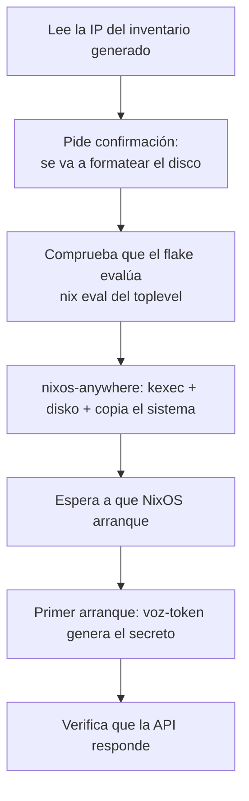

# Despliegue

De nada a un sistema de voz funcionando. El ciclo es **`provision → install → update`**: Terraform crea la
VM, `nixos-anywhere` la reinstala desde el flake, y Ansible encadena y verifica los pasos.

- [Antes de empezar](#antes-de-empezar)
- [1 · Configurar los dos ficheros](#1--configurar-los-dos-ficheros)
- [2 · Crear la VM](#2--crear-la-vm)
- [3 · Instalar NixOS](#3--instalar-nixos)
- [4 · Comprobar que funciona](#4--comprobar-que-funciona)
- [El día a día: actualizar](#el-día-a-día-actualizar)
- [Volver atrás](#volver-atrás)
- [Problemas frecuentes](#problemas-frecuentes)
- [Apéndice: despliegue manual](#apéndice-despliegue-manual)

---

## Antes de empezar

En tu máquina, **Nix con flakes** y nada más. El resto lo trae el entorno:

```bash
nix develop
```

Eso pone en el `PATH` OpenTofu, Ansible, `uv`, `jq`, `curl` y —en Linux— `nixos-anywhere` y
`nixos-rebuild`.

En el hipervisor, un **Proxmox VE** y un token de API. Se crea en el host con:

```bash
pveum user token add root@pam terraform --privsep 0
```

Devuelve un UUID que **solo se muestra una vez**.

> **Aviso.** `install.yml` formatea el disco de la VM. Pide confirmación antes de hacerlo, pero conviene
> saberlo: `disko` no pregunta nada por su cuenta.

### Lo que crea Terraform

Con los valores por defecto de [`terraform/variables.tf`](../terraform/variables.tf):

| | |
|---|---|
| VM | id `210`, nombre `voz`, en el nodo `pve` |
| CPU | 8 núcleos, tipo `host` — [el óptimo medido son 6 hilos anclados; más empeora](rendimiento.md#los-hilos-más-no-es-mejor) |
| RAM | 6144 MB — valida que no bajes de 4 GB. VibeVoice queda en ~2,8 GB residentes, pero **el pico es la carga** |
| Disco | 40 GB en `local-lvm`, interfaz `scsi0` → **`/dev/sda`** |
| Red | VirtIO en `vmbr0`, con agente QEMU |
| Imagen base | Debian 12 *genericcloud*, sobre la que `nixos-anywhere` hace `kexec` |

No hay *passthrough* de GPU, y es deliberado: [la iGPU resultó 2,5× más lenta que la
CPU](rendimiento.md#por-qué-no-hay-gpu).

---

## 1 · Configurar los dos ficheros

Son dos, y **las claves SSH tienen que coincidir en ambos**.

```bash
cp terraform/terraform.tfvars.example terraform/terraform.tfvars
$EDITOR terraform/terraform.tfvars   # token de Proxmox, IP, recursos
$EDITOR nix/host.nix                 # tu clave pública y el disco
```

**`terraform/terraform.tfvars`** — está en el `.gitignore`, el token no entra al repositorio:

```hcl
proxmox_endpoint  = "https://192.168.2.100:8006/"
proxmox_api_token = "root@pam!terraform=00000000-0000-0000-0000-000000000000"

node = "pve"
vmid = 210

cores      = 8
memoria_mb = 6144
disco_gb   = 40

# IP fija: nixos-anywhere necesita saber a dónde conectarse. Con DHCP hay que
# esperar al agente; con fija, el despliegue va de un tirón.
ip_cidr = "192.168.2.54/24"
gateway = "192.168.2.1"

claves_ssh = [ "ssh-ed25519 AAAA... tu-usuario@tu-maquina" ]
```

**[`nix/host.nix`](../nix/host.nix)** — lo único específico de tu máquina dentro del flake:

```nix
{
  homelab = {
    clavesSSH = [ "ssh-ed25519 AAAA... tu-usuario@tu-maquina" ];  # la misma de arriba
    disco = "/dev/sda";                                            # scsi0 → sda
  };

  networking.hostName = "voz";
}
```

**La clave SSH no es opcional.** Sin al menos una, el sistema no evalúa siquiera: hay una aserción en
[`nix/configuration.nix`](../nix/configuration.nix) que lo impide, porque la VM quedaría sin ninguna forma
de entrar —no hay contraseñas ni consola configurada.

Si quieres cambiar voces, modelo de whisper o puertos, es el momento: la referencia está en
[opciones.md](opciones.md).

---

## 2 · Crear la VM

```bash
ansible-playbook ansible/playbooks/provision.yml
```

El playbook comprueba que existe `terraform.tfvars`, lanza `tofu init` y `tofu apply`, y deja el
inventario con la IP de la VM para los pasos siguientes.

---

## 3 · Instalar NixOS

```bash
ansible-playbook ansible/playbooks/install.yml
```



Fíjate en el orden: **valida el flake antes de tocar la VM**. Si la configuración no evalúa, te enteras
antes de haber formateado nada, no después.

---

## 4 · Comprobar que funciona

El playbook ya verifica que la API responde, pero para mirarlo tú:

```bash
curl -s http://IP-DE-LA-VM:8080/health | jq
```

```json
{
  "estado": "ok",
  "tts": {
    "motor": "piper",
    "voces": ["es_ES-davefx-medium", "es_MX-ald-medium", "es_MX-claude-high"],
    "por_defecto": "es_MX-claude-high",
    "cargadas": []
  },
  "stt": { "motor": "whisper.cpp", "url": "http://127.0.0.1:8081", "disponible": true },
  "auth": "bearer"
}
```

Dos campos que mirar: `stt.disponible` tiene que ser `true` —si es `false`, whisper no arrancó— y `auth`
tiene que decir `bearer`; si dice `abierta`, el token no llegó al servicio.

**Coge el token**, que se generó solo en el primer arranque y vive fuera del store:

```bash
ssh juan@IP-DE-LA-VM sudo cat /var/lib/voz/token.env
```

**Prueba el TTS:**

```bash
curl -X POST http://IP-DE-LA-VM:8080/tts -H "Authorization: Bearer TU_TOKEN" -H "Content-Type: application/json" -d '{"texto":"El homelab ya tiene voz."}' -D- --output saludo.ogg
```

Las cabeceras `X-Duracion-S`, `X-Proceso-S` y `X-RTF` te dan la medición de esa síntesis concreta.

**Prueba el STT** con el fichero que acabas de generar:

```bash
curl -X POST http://IP-DE-LA-VM:8080/stt -H "Authorization: Bearer TU_TOKEN" -F "archivo=@saludo.ogg" -F "idioma=es" | jq
```

**Prueba VibeVoice** (RTF 0,75 tras optimizar; la primera carga tarda ~2 min):

```bash
ssh juan@IP-DE-LA-VM
vibevoice --texto "Esto lo dice el modelo expresivo." --salida prueba.wav
```

**Y el streaming**, que es donde se nota — primer sonido en 0,20 s:

```bash
curl -sN -X POST http://IP-DE-LA-VM:8082/tts -H "Authorization: Bearer TU_TOKEN" -H "Content-Type: application/json" -d '{"texto":"Se oye según se genera."}' | ffplay -autoexit -nodisp -
```

O abre la consola en `http://IP-DE-LA-VM:8080/`, que muestra el pipeline por estados y colores.

La referencia completa de la API está en [api.md](api.md).

---

## El día a día: actualizar

Tras cambiar cualquier cosa en `nix/`:

```bash
ansible-playbook ansible/playbooks/update.yml
```

Comprueba que el flake evalúa, aplica la configuración con `nixos-rebuild` y confirma que la API sigue en
pie. Nunca formatea nada.

**Actualizar las dependencias** (nixpkgs, disko, uv2nix…):

```bash
nix flake update                       # todas
nix flake update nixpkgs               # solo una
```

Después, `update.yml`. El `flake.lock` que cambia es la única prueba de qué versión estaba corriendo.

**Cambiar el código Python de la API** requiere además regenerar el lock de su workspace:

```bash
cd pkgs/voz-api && uv lock
```

Si tocas el de VibeVoice, revisa la versión de `transformers` que resuelve: el entorno usa la **4.57.6**,
no la 4.51.3 que fija el extra `streamingtts` del repositorio original. Funciona, pero es lo primero que
hay que mirar si algo se rompe.

---

## Volver atrás

Cada reconstrucción crea una generación y **ninguna borra la anterior**. Si algo sale mal:

```bash
sudo nixos-rebuild switch --rollback        # a la generación anterior
```

Si la máquina ni siquiera arranca, el menú de `systemd-boot` lista todas las generaciones: se elige una
antigua y arranca con ella. Nada de lo que hagas al reconstruir toca las generaciones ya instaladas.

Para ver qué hay:

```bash
sudo nix-env --list-generations --profile /nix/var/nix/profiles/system
```

El recolector de basura corre semanalmente y borra lo que tenga más de 30 días.

**Lo único que no se recupera desde el flake** es `/var/lib/voz/token.env`. Si lo borras, el siguiente
arranque genera uno nuevo y hay que actualizar los clientes.

---

## Problemas frecuentes

| Síntoma | Causa y solución |
|---|---|
| *«Falta terraform/terraform.tfvars»* | `provision.yml` para antes de hacer nada. Copia el `.example` y rellénalo. |
| La evaluación falla con *«homelab.clavesSSH está vacío»* | No pusiste tu clave pública en `nix/host.nix`. Es una aserción a propósito. |
| *«services.vibevoice necesita ~4 GB… no define swap»* | Aserción del módulo: añade `swapDevices` o desactiva `services.vibevoice`. |
| `nixos-anywhere` no conecta | La VM no tiene IP fija y el inventario quedó a medias. Pon `ip_cidr` en `terraform.tfvars`. |
| `disko` formatea el disco que no era | `homelab.disco` no coincide con la controladora. Terraform usa `scsi0` → `/dev/sda`. Comprueba con `lsblk`. |
| El sistema instala pero no arranca | La VM no está en modo UEFI. `systemd-boot` necesita una ESP. |
| *«vozDefecto tiene que estar en voces»* | La voz por defecto no está en la lista instalada. Ver [opciones.md](opciones.md). |
| *«abrir voz-api en la LAN sin ficheroToken…»* | `abrirCortafuegos = true` exige `ficheroToken`. Evita exponer el servicio sin autenticación. |
| `401 token invalido o ausente` | Falta la cabecera `Authorization: Bearer …`, o no es el token de `/var/lib/voz/token.env`. |
| `/health` dice `"disponible": false` | `whisper-server` no está levantado: `journalctl -u homelab-whisper -e`. |
| `400 no pude decodificar el audio` | `ffmpeg` no reconoce el fichero. El mensaje incluye su salida de error. |
| El STT transcribe mal la jerga | Ajusta `services.voz-api.promptSTT` con tu vocabulario; es el parámetro que más cambia el resultado. |
| VibeVoice se va a swap | Queda en ~2,8 GB residentes, pero **cargar** pica más. No lo lances mientras `voz-api` sirve si la VM va justa. |

**Dónde mirar cuando nada de lo anterior encaja:**

```bash
journalctl -u voz-api -u homelab-whisper -u voz-token -e
```

### Si construyes desde un Mac ARM

Necesitas una máquina `x86_64-linux` para construir el sistema. Dos detalles que muerden al instalar Nix en
un LXC de Proxmox:

- El **sandbox funciona** en contenedores no privilegiados; no hace falta `sandbox = false`.
- `channels.nixos.org` resuelve **solo por IPv6**. Sin ruta IPv6, cualquier `nix run nixpkgs#loquesea`
  falla con *«Could not resolve host»*. Se desactiva con `flake-registry = ` (vacío) en
  `/etc/nix/nix.conf`. Este repositorio no lo necesita porque todo va por `flake.lock`.

---

## Apéndice: despliegue manual

Si no quieres usar Terraform —porque la VM ya existe, o porque el hipervisor no es Proxmox— el ciclo se
reduce a `nixos-anywhere` contra cualquier máquina con SSH y `root`:

```bash
nix run github:nix-community/nixos-anywhere -- --flake .#voz root@IP-DE-LA-VM
```

Los requisitos de la máquina destino son los mismos que crea Terraform: **UEFI (OVMF)**, controladora
**VirtIO SCSI** (→ `/dev/sda`; con VirtIO Block sería `/dev/vda` y hay que ajustar `homelab.disco`), 8
núcleos, 6 GB de RAM y 40 GB de disco. Arranca con el ISO mínimo de NixOS o con cualquier Linux que tenga
SSH: `nixos-anywhere` usa `kexec` para saltar al instalador.

Para actualizar sin Ansible, desde Linux:

```bash
nixos-rebuild switch --flake .#voz --target-host root@IP-DE-LA-VM
```

Desde macOS no funciona igual —`nixos-rebuild` no está en el `devShell` para Darwin y construir
`x86_64-linux` desde un Mac ARM necesitaría un constructor remoto—, así que la vía práctica es reconstruir
desde la propia VM:

```bash
ssh juan@IP-DE-LA-VM
sudo nixos-rebuild switch --flake github:juan52878911/VibeVoiceNix#voz
```
