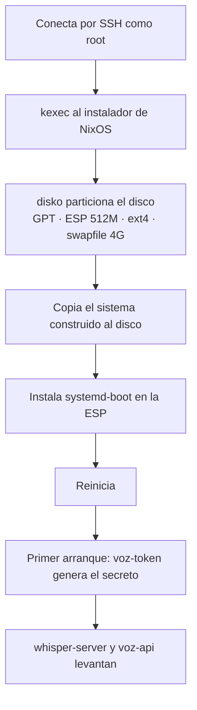

# Despliegue

De una VM vacía en Proxmox a un sistema de voz funcionando. Después: cómo actualizarlo, cómo volver atrás
y qué hacer cuando algo falla.

- [Antes de empezar](#antes-de-empezar)
- [1 · Crear la VM en Proxmox](#1--crear-la-vm-en-proxmox)
- [2 · Configurar el repositorio](#2--configurar-el-repositorio)
- [3 · Instalar con nixos-anywhere](#3--instalar-con-nixos-anywhere)
- [4 · Comprobar que funciona](#4--comprobar-que-funciona)
- [Actualizar el sistema](#actualizar-el-sistema)
- [Volver atrás](#volver-atrás)
- [Problemas frecuentes](#problemas-frecuentes)
- [Provisión automática (pendiente)](#provisión-automática-pendiente)

---

## Antes de empezar

En tu máquina hace falta **Nix con flakes activados** y poco más:

```bash
nix develop
```

Eso trae OpenTofu, Ansible, `uv`, `jq`, `curl` y —en Linux— `nixos-anywhere` y `nixos-rebuild`. No hay que
instalar nada en el sistema.

En el hipervisor hace falta un **Proxmox VE** con sitio para una VM x86-64. No hace falta GPU: todo el
stack corre en CPU a propósito, y el motivo está medido en [rendimiento.md](rendimiento.md).

> **Aviso.** `disko` formatea el disco que le indiques **sin preguntar nada**. Antes del primer despliegue,
> comprueba con `lsblk` qué disco es y que está vacío.

---

## 1 · Crear la VM en Proxmox

### Ajustes que importan

| Ajuste | Valor | Por qué |
|---|---|---|
| BIOS | **OVMF (UEFI)** | el sistema arranca con `systemd-boot`, que necesita una partición EFI |
| Máquina | `q35` | recomendada para UEFI |
| Controladora SCSI | **VirtIO SCSI** | el disco aparece como `/dev/sda` — es lo que asume `nix/host.nix` |
| Disco | 40 GB (30 sin VibeVoice) | ver la tabla de recursos en el [README](../README.md#la-vm) |
| CPU | 6–8 núcleos, tipo `host` | `whisper` usa 6 hilos y VibeVoice 8 |
| RAM | 8 GB | VibeVoice pide ~4 GB en el pico |
| Red | VirtIO, puente a la LAN, DHCP | |
| Agente QEMU | activado | el perfil `qemu-guest` ya está importado en el sistema |

Desde la interfaz web se hace en un par de minutos. Desde la consola del nodo, el equivalente sería algo
así —**revisa los nombres de almacenamiento, que varían en cada instalación**:

```bash
qm create 120 --name voz --machine q35 --bios ovmf --cpu host --cores 6 --memory 8192 --scsihw virtio-scsi-single --scsi0 local-lvm:40 --efidisk0 local-lvm:0,efitype=4m --net0 virtio,bridge=vmbr0 --ide2 local:iso/latest-nixos-minimal-x86_64-linux.iso,media=cdrom --boot 'order=ide2;scsi0' --agent 1
```

### Arrancarla con acceso SSH

`nixos-anywhere` necesita entrar por SSH como `root` en la máquina destino. Lo más cómodo es el **ISO
mínimo de NixOS**: arranca, y en la consola de Proxmox pon una contraseña temporal para poder entrar.

```bash
sudo passwd root          # en la consola de la VM
ip addr                   # apunta la IP
```

Cualquier sistema Linux con SSH y `root` vale igual: `nixos-anywhere` usa `kexec` para saltar al instalador.

### Comprobar el disco

Ya dentro de la VM por SSH, antes de nada:

```bash
lsblk
```

Con VirtIO SCSI verás `sda`. Si ves `vda`, la controladora es VirtIO Block y hay que cambiar
`homelab.disco` en el paso siguiente.

---

## 2 · Configurar el repositorio

Solo hay un fichero que tocar: [`nix/host.nix`](../nix/host.nix).

```nix
{
  homelab = {
    clavesSSH = [
      "ssh-ed25519 AAAA... tu-usuario@tu-maquina"   # ← tu clave pública
    ];

    disco = "/dev/sda";                              # ← lo que viste en lsblk
  };

  networking.hostName = "voz";
}
```

**La clave SSH no es opcional.** Sin al menos una, el sistema no evalúa siquiera: hay una aserción en
[`nix/configuration.nix`](../nix/configuration.nix) que lo impide, porque la VM quedaría sin ninguna forma
de entrar —no hay contraseñas ni consola configurada.

Si quieres cambiar voces, modelo de whisper o puertos, es el momento; la referencia está en
[opciones.md](opciones.md). Todo tiene valores por defecto razonables.

Y antes de lanzar la instalación, comprueba que el sistema evalúa y compila:

```bash
nix build .#nixosConfigurations.voz.config.system.build.toplevel
```

La primera vez tarda: hay que traerse los modelos y construir los entornos de Python.

---

## 3 · Instalar con nixos-anywhere

```bash
nix run github:nix-community/nixos-anywhere -- --flake .#voz root@IP-DE-LA-VM
```

O, si ya estás dentro del `devShell` en Linux, directamente `nixos-anywhere --flake .#voz root@IP-DE-LA-VM`.

Lo que ocurre, en orden:



No hay preguntas ni pasos manuales. Cuando termine y la VM reinicie, ya está.

---

## 4 · Comprobar que funciona

**El sistema responde:**

```bash
ssh juan@IP-DE-LA-VM systemctl status voz-api homelab-whisper --no-pager
```

**La API está viva.** `/health` no pide token a propósito, para poder monitorizarla:

```bash
curl -s http://IP-DE-LA-VM:8080/health | jq
```

```json
{
  "estado": "ok",
  "tts": {
    "motor": "piper",
    "voces": ["es_ES-davefx-medium", "es_MX-ald-medium", "es_MX-claude-high"],
    "por_defecto": "es_MX-claude-high",
    "cargadas": []
  },
  "stt": { "motor": "whisper.cpp", "url": "http://127.0.0.1:8081", "disponible": true },
  "auth": "bearer"
}
```

Fíjate en dos campos: `stt.disponible` tiene que ser `true` —si es `false`, whisper no arrancó— y `auth`
tiene que decir `bearer`; si dice `abierta`, el token no llegó al servicio.

**Coge el token**, que se generó solo en el primer arranque:

```bash
ssh juan@IP-DE-LA-VM sudo cat /var/lib/voz/token.env
```

**Prueba el TTS:**

```bash
curl -X POST http://IP-DE-LA-VM:8080/tts -H "Authorization: Bearer TU_TOKEN" -H "Content-Type: application/json" -d '{"texto":"El homelab ya tiene voz."}' -D- --output saludo.ogg
```

Las cabeceras `X-Duracion-S`, `X-Proceso-S` y `X-RTF` te dan la medición de esa síntesis concreta.

**Prueba el STT** con el fichero que acabas de generar:

```bash
curl -X POST http://IP-DE-LA-VM:8080/stt -H "Authorization: Bearer TU_TOKEN" -F "archivo=@saludo.ogg" -F "idioma=es" | jq
```

**Prueba el laboratorio** (opcional, tarda; ~44 s de cómputo por cada 9 s de audio):

```bash
ssh juan@IP-DE-LA-VM
vibevoice --txt_path guion.txt --speaker_names sp-Spk0_woman
```

La referencia completa de la API, con todos los parámetros y errores, está en [api.md](api.md).

---

## Actualizar el sistema

Todo cambio pasa por el flake: se edita, se reconstruye, y el sistema pasa a la nueva generación.

**Desde Linux**, contra la VM:

```bash
nixos-rebuild switch --flake .#voz --target-host root@IP-DE-LA-VM
```

**Desde macOS** no funciona igual: `nixos-rebuild` no está en el `devShell` para Darwin y construir
`x86_64-linux` desde un Mac ARM necesitaría un constructor remoto. La vía práctica es reconstruir desde la
propia VM:

```bash
ssh juan@IP-DE-LA-VM
sudo nixos-rebuild switch --flake github:juan52878911/VibeVoiceNix#voz
```

**Actualizar las dependencias** (nixpkgs, disko, uv2nix…):

```bash
nix flake update                       # todas
nix flake update nixpkgs               # solo una
```

Después reconstruye. El `flake.lock` que cambia es la única prueba de qué versión estaba corriendo.

**Cambiar el código Python de la API** requiere además regenerar el lock de su workspace:

```bash
cd pkgs/voz-api && uv lock
```

---

## Volver atrás

Cada reconstrucción crea una generación y **ninguna borra la anterior**. Si algo sale mal:

```bash
sudo nixos-rebuild switch --rollback        # a la generación anterior
```

Si la máquina ni siquiera arranca, el menú de `systemd-boot` lista todas las generaciones: se elige una
antigua y arranca con ella. Nada de lo que hagas al reconstruir toca las generaciones ya instaladas.

Para ver qué hay:

```bash
sudo nix-env --list-generations --profile /nix/var/nix/profiles/system
```

El recolector de basura corre semanalmente y borra lo que tenga más de 30 días.

**Lo único que no se recupera desde el flake** es `/var/lib/voz/token.env`. Si lo borras, el siguiente
arranque genera uno nuevo y hay que actualizar los clientes.

---

## Problemas frecuentes

| Síntoma | Causa y solución |
|---|---|
| La evaluación falla con *«homelab.clavesSSH está vacío»* | No pusiste tu clave pública en `nix/host.nix`. Es una aserción a propósito. |
| `disko` no encuentra el disco, o formatea el que no era | `homelab.disco` no coincide con la controladora. `lsblk` en la VM: VirtIO SCSI → `/dev/sda`, VirtIO Block → `/dev/vda`. |
| El sistema instala pero no arranca | La VM no está en modo UEFI (OVMF). `systemd-boot` necesita una ESP. |
| *«vozDefecto tiene que estar en voces»* | La voz por defecto no está en la lista instalada. Ver [opciones.md](opciones.md). |
| *«abrir voz-api en la LAN sin ficheroToken…»* | `abrirCortafuegos = true` exige `ficheroToken`. Es la aserción que evita exponer el servicio sin autenticación. |
| `401 token invalido o ausente` | Falta la cabecera `Authorization: Bearer …`, o el token no es el de `/var/lib/voz/token.env`. |
| `/health` dice `"disponible": false` | `whisper-server` no está levantado: `journalctl -u homelab-whisper -e`. |
| `503 whisper-server no responde` | Lo mismo, visto desde una petición de STT. |
| `400 no pude decodificar el audio` | `ffmpeg` no reconoce el fichero. El mensaje incluye su salida de error. |
| El STT transcribe mal la jerga | Ajusta `services.voz-api.promptSTT` con tu propio vocabulario; es el parámetro que más cambia el resultado. |
| VibeVoice se va a swap o muere | Necesita ~4 GB libres. No lo lances mientras `voz-api` está sirviendo si la VM tiene menos de 6 GB. |

**Dónde mirar cuando nada de lo anterior encaja:**

```bash
journalctl -u voz-api -u homelab-whisper -u voz-token -e
```

---

## Provisión automática (pendiente)

El `devShell` trae OpenTofu y Ansible, y su `shellHook` anuncia un
`ansible-playbook ansible/playbooks/provision.yml` que **todavía no existe en el repositorio**. El
`.gitignore` ya reserva sitio para el estado de Terraform y el inventario generado de Ansible.

La intención es cerrar el círculo: que OpenTofu cree la VM contra la API de Proxmox y Ansible encadene
`provision → install → update`, de modo que pasar de nada a un sistema funcionando sea una sola orden. Hasta
entonces, el paso 1 de esta guía se hace a mano.
